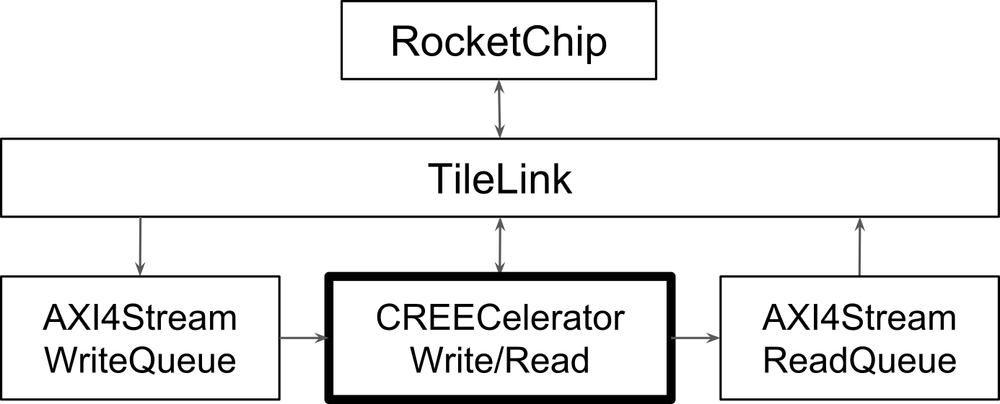

# CREECelerator

[](https://travis-ci.org/ucberkeley-ee290c/fa18-smartnic)

CREECelerator is a collection of *composable and modular* hardware accelerators for compression, AES encryption, and Reed-Solomon codes (ECC)
implemented in Chisel. The accelerators can be arbitrarily composed and can interface with a host to provide both OS-invisible
or filesystem-aware **storage acceleration** capabilities.

This repo contains generic implementations of compression (RLE), encryption (AES), and error-correcting code (Reed Solomon) blocks.
They are integrated together using a simple custom bus called CREECBus.

<p align="center">

</p>

This pipeline is integrated with Rocket-chip based on the ucb-bar [project template](https://github.com/ucb-bar/project-template).

<p align="center">

</p>

Support for transaction level modeling and verification is a key component in CREECBus.

Synthesis has been tested for the Xilinx VC707 using [Hammer](https://github.com/ucb-bar/hammer).

## Project Background
This project was completed by Bob Zhou, Kyle Kovacs, Vighnesh Iyer, and Tan Nguyen for the Fall 2018 offering of
EE290C at UC Berkeley. The goal of this class was to implement various hardware processors using Chisel generators
for agile system-on-a-chip design. Our project focuses on hardware acceleration of data storage enhancements and modeling those
blocks for design exploration.

# Initial Setup
```
git clone git@github.com:ucberkeley-ee290c/fa18-smartnic
cd fa18-smartnic
git submodule update --init --recursive

# Clean local ivy package cache of chisel/firrtl JARs
rm -rf ~/.ivy2/local/edu.berkeley.cs/firrtl*
rm -rf ~/.ivy2/local/edu.berkeley.cs/chisel*

cd firrtl
sbt "compile; +publishLocal"

cd ../chisel3
sbt "compile; +publishLocal"
```

# Building / Testing
At the top level of `fa18-smartnic`, run `sbt compile` and `sbt test`.
You can also use `sbt testOnly` to run specific tests.
Many of our full pipeline tests require large amounts of memory (> 1GB). We recommend setting SBT's memory limit to
2GB or more using `sbt -mem 2048`.


## Integration testing
We have integrated the CREECelerator pipelines to the Rocket-chip infrastructure in a similar manner to the CORDIC lab. The pipelines communicate with the host processor via separate AXI4-Stream queues and memory-mapped registers. The CREECelerator pipelines with Rocket-chip can be compiled to a Verilator-based executable.

They can be made using the Makefile in the `verisim` directory. Running `make debug` will produce executables that can provide waveform dumps.
To build the pipelines, run `make MODEL=TestHarness`.

A basic C test can be found in the `tests` directory. `creec.riscv` is a combined test for the write and read pipelines. It can be compiled to `riscv` test stimuli using make from the `tests` directory,
which can then be run using the generated executable. Compilation requires a shell path to [riscv-tools](https://github.com/riscv/riscv-tools),
which is included in the project template described above.

```
cd $PROJECT_DIR/tests/
make
cd $PROJECT_DIR/verisim/
make MODEL=TestHarness
./simulator-freechips.rocketchip.system-DefaultConfig ../tests/creec.riscv
```

## Synthesis using Hammer
[Hammer](https://github.com/ucb-bar/hammer) setup files exist as a submodule in this project.

Setup the path to Vivado installation on your machine in the file `config/vivado_setup.sh`.

To change the clock constraint (or add new constraint), modify the file `config/constraint.xdc`. Note that we do not use `config/clocks.json`.

To select an FPGA, use one of the YAML files in the `config` folder. For example, to use the VC707 FPGA, use "VC707" as `FPGANAME` in the run command.

To synthesize a Verilog file with Hammer (Vivado logic synthesis), use the following command:

```
./runhammer.sh {path/to/verilog_file.v} {FPGANAME}
```

The timing and area report will be generated inside the directory `out_{verilog_top_module}_{FPGANAME}`.

# Docs
## Generators
1. Differential + Run-Length (De)Compressor ([design doc](doc/compression.md), [testing doc](doc/compression_tests.md))
2. AES128 (De)Encryptor ([design doc](doc/AES.md), [testing doc](doc/AES.md))
3. Reed-Solomon ECC (De)Encoder ([design doc](doc/ECC.md), [testing doc](doc/ECC_tests.md))
4. Bus Interconnect and Bus Components ([design doc](doc/Interconnect_and_Bus_Components.md))
## Verification Infrastructure
[Go here for details](doc/Transaction_Level_Modeling.md) on the transaction-level modeling framework, the design and testing of software models, and how to use transaction stimulus to drive RTL simulation
## Top-Level Integration
[Go here for details](doc/Top_Level_Integration.md) on the top-level `CREECelerator` which chains together the compression -> encryption -> ECC blocks and gives an overview of top-level testing.
## Source Code
- Compression: source in `src/main/scala/compression`, tests in `src/test/scala/compression`.
- AES Encryptor: source in `src/main/scala/aes`, tests in `src/test/scala/aes`.
- ECC: source in `src/main/scala/ecc`, tests are in `src/test/scala/ecc`.
- Bus Specification and Components, Verification Infrastructure, Top-Level CREECelerator: source in `src/main/scala/interconnect`, tests are in `src/test/scala/interconnect`.
## Paper and Presentation
- [Go here for the paper](doc/CREEC.pdf)
- [Go here for the presentation](doc/CREECelerator_Final_Presentation.pdf)

# Supplemental
## Building and Testing With Mill
This project can be compiled and tested with [mill](https://github.com/lihaoyi/mill) instead of sbt with a few caveats.

### Installation
You still need to use sbt to `+publishLocal` the firrtl and chisel3 submodules first. This is only done once.

I'm using mill version 0.3.4. Install with:
```
sudo sh -c '(echo "#!/usr/bin/env sh" && curl -L https://github.com/lihaoyi/mill/releases/download/0.3.4/0.3.4) > /usr/local/bin/mill && chmod +x /usr/local/bin/mill'
```

### Building / Testing
You can ask mill what tasks it can perform with `mill resolve _`, then `mill resolve creec._`. Try running `mill creec.compile`.

Notice that `creec` can be cross-built to scala 2.12.4 or 2.11.12. Building for scala 2.12 is the default. You can make this explicit with `mill creec[2.12.4].compile`.

Mill can watch for file changes for running any task and update if any changes are seen. `mill -w creec[2.12.4].compile`.

Testing is a bit of an issue with mill. Scalatest doesn't support providing a specific test suite or test to run from its test runner main class, and instead relies on some special hooks in sbt.

As a result, it is preferred to use `uTest` to run tests using mill. See `src/test/scala/interconnect/CREECPassthroughTest.scala` for an example.

To run all `uTest` tests use `mill creec[2.12.4].test`, and to run a specific test use `mill creec[2.12.4].test interconnect.CREECPassthroughTest.produceOutput`.

You can use the `-w` watch command for tests as well.
