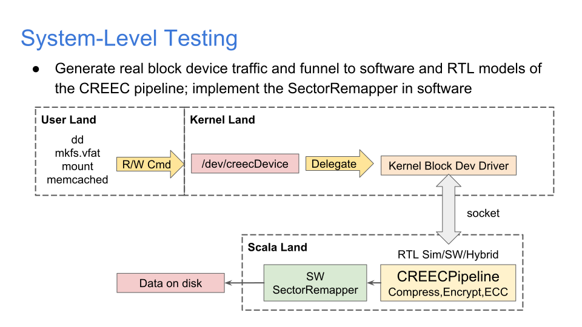

# CREECelerator Description
The CREECelerator write-path consists of chaining together the compression -> encryption (AES) -> ECC (Reed-Solomon Encoder) blocks in this order. The CREECelerator read-path contains these blocks in the opposite order.

The CREECelerator is designed to be used in the following applications:

- An OS-invisible storage acceleration unit which sits in between the block device visible to the OS and the physical disk controller. This pipeline can improve SSD endurance with the compression functionality, add within-sector redundancy with the ECC functionality, or provide transparent full disk encryption facilities.

- A OS-visible fixed-function accelerator for filesystem-level implementations of compression/encryption/ECC. As an example, ZFS supports all three capabilities to some extent and dedicated hardware accelerators can provide a considerable performance boost for the filesystem, while also saving CPU cores from doing these tasks.

## Parameters/IOs
Both the write and read paths take no parameters and have standard CREECBus top-level IOs.

```scala
class CREECeleratorWrite extends Module {
  val io = IO(new Bundle {
    val in = Flipped(new CREECBus(BusParams.blockDev))
    val out = new CREECBus(BusParams.creec)
  })
```

From this level, the CREECBus is bridged to `BlockDeviceIO` (from testchipip) or AXI4-Stream if a memory mapped connection to rocket is desired.

## Top-Level Testing
### Software Modeling
The loopback CREECelerator software test is in `/src/test/scala/interconnect/CREECeleratorSWTest.scala`. It can be run with `sbt testOnly interconnect.CREECeleratorSWTest`. It composes software models of every part of the CREEC write pipeline and loops back into the CREEC read pipeline model. A noisy 'channel' is added between the write and read paths to simulate bit errors that the Reed-Solomon decoder can recover from. We demonstrate that the model can successfully process a 24KB text file.

### RTL Testing
The RTL test of the CREECelerator pipelines is in `src/test/scala/interconnect/CREECeleratorHWTest.scala`. It is run with `sbt testOnly interconnect.CREECeleratorHWTest`. The RTL simulation proceeds slowly (~10 Hz) due to limitations in treadle. As a result, only a few transactions can be pushed through the pipeline in a reasonable time and without running into a OutOfMemory exception. But it works!

## Ideas for System-Level Testing


Our plans for system-level testing involved setting up a virtual block device on a host OS which proxies `bio` struct data to an RTL simulator running the CREECelerator in Scala to test it with real block device interaction. There is still work to do on speeding up treadle to accomodate this use case and getting Verilator support for testers2 working.

We are working on integrating `CREECeleratorWrite` with rocket-chip in a similar manner to the CORDIC lab.
