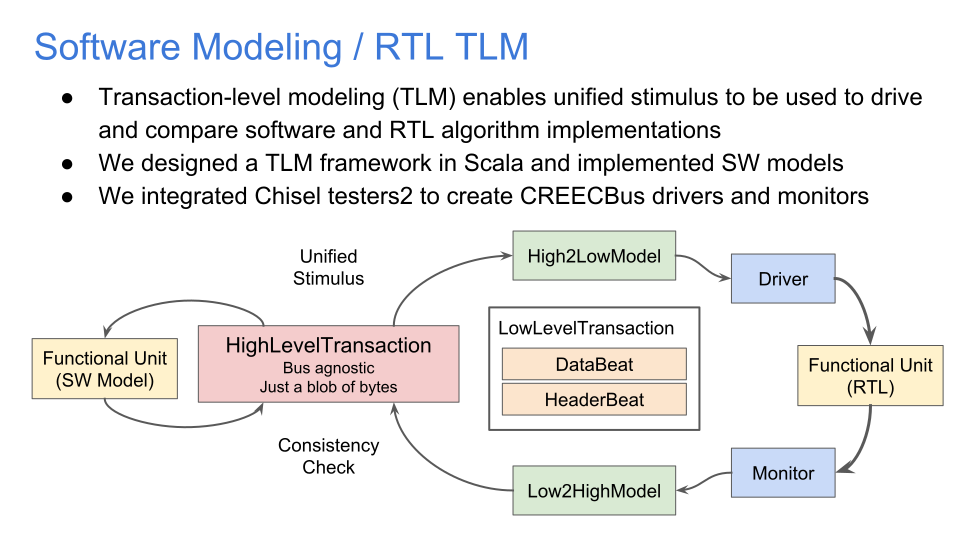

# Transaction Abstraction
In the pursuit of a unified SW testing and RTL stimulus/checking infrastructure, we created a transaction-level modeling framework in Scala for this project. The primary source can be found in `src/main/scala/TransactionModeling.scala`.

The abstract notion of a `Transaction` is just a chunk of data and control that a given block can process or produce.

We defined 2 levels of `Transaction` abstractions specific to the CREECBus.

`CREECHighLevelTransaction`s (HLT) consist of a chunk of `data` represented as a Scala `Seq[Byte]`. The high-level transaction is CREECBus `BusParams` agnostic and can even exist independently of the CREECBus (for instance it could just as easily drive a AXI4-Stream interface). As time went on, we began to add metadata fields to the HLT, and a constraint that the chunk of `data` must be 8B aligned, but this was a poor decision in hindsight as it made the HLT no longer bus agnostic. Most blocks in our CREEC project are modeled using HLTs, since they just operate on a chunk of bytes and spit out another chunk of bytes.

`CREECLowLevelTransaction`s (LLT) can be either a `CREECHeaderBeat` or `CREECDataBeat`, and they represent a single header or data beat respectively. LLTs are `BusParams` specific and they are designed to be driven or monitored on a specific instance of the CREECBus. They expose the inner details of the bus, and therefore closely resemble the `TransactionHeader` and `TransactionData` Bundles which make up the CREECBus Bundle. Only a few blocks are modeled using LLTs, such as the width converter and CREEC passthrough.




# Software Modeling
We defined a formal notion of a software model for our blocks in `TransactionModeling.scala` in the `SoftwareModel` abstract class. A `SoftwareModel` is type parameterized on the types of input and output transactions it can receive and send.

A concrete `SoftwareModel` is created for each block in our project. A concrete model implements the `process` function of `SoftwareModel` which takes one transaction of the `SoftwareModel`'s input type and returns a `Seq` of transactions of the `SoftwareModel`'s output type. This means for a given input transaction, and the current state of the model, none, one, or multiple output transactions may be produced on a call to `process`.

For a simple example, see the `CREECPassthroughModel` defined in `src/main/scala/interconnect/CREECPassthrough.scala`. The AES model is also easy to understand in `src/main/scala/aes/AESSWModel.scala`. It just takes a HLT, passes its data through the Java standard crypto library's AES function, and returns the encrypted data from a copy of the input HLT.

## Bridging from High -> Low or Low -> High
HLTs can be converted into LLTs using the `CREECHighToLowModel` which specializes a HLT for a specific CREECBus with specific BusParams and emits LLTs which can drive the physical bus. This permits the same HLTs to be used for testing the compressor and AES blocks (software and RTL) even though they use different BusParams.

```scala
val high2Low = new CREECHighToLowModel(BusParams.creec)
val out: Seq[CREECLowLevelTransaction] = high2Low.processTransactions(Seq(CREECHighLevelTransaction(Seq(1, 2, 3, 4, 5, 6, 7, 8), 0x0)))
```

LLTs can be converted back into HLTs (for example, from a RTL bus monitor) using the `CREECLowToHighModel`. In doing so, the LLTs are checked for consistency as they are converted, catching FSM mistakes like transmitting a data beat before transmitting its associated header beat. Top-level testing is all done using the HLT abstraction, so LLTs from RTL are converted into HLTs to be compared against the golden software model.

## Testing a Software Model
The software model is intended to be a golden reference for comparing the RTL model against. So the software model itself needs to be checked against hand-verified inputs and outputs. The AES SW model test (in `src/test/scala/aes/CREECBusAESTest.scala` is a great example of how to do this:

```scala
val data = Seq(CREECHighLevelTransaction(Seq(
    1, 1, 1, 1, 1, 1, 1, 1,
    1, 1, 1, 1, 1, 3, 3, 2,
    1, 1, 1, 1, 1, 1, 1, 1,
    1, 1, 1, 1, 1, 3, 3, 2
).map(_.asInstanceOf[Byte]), 0x0))

val encryptedData = Seq(CREECHighLevelTransaction(Seq(
    0x14, 0x23, 0x6b, 0xd1, 0xce, 0x59, 0x26, 0xe1,
    0x38, 0xad, 0x15, 0x85, 0x82, 0xd4, 0x5c, 0x3c,
    0x14, 0x23, 0x6b, 0xd1, 0xce, 0x59, 0x26, 0xe1,
    0x38, 0xad, 0x15, 0x85, 0x82, 0xd4, 0x5c, 0x3c
).map(_.asInstanceOf[Byte]), 0x0, encrypted = true))

"AESSWModel" should "encrypt high" in {
    val aesEncryptModel = new CREECEncryptHighModel
    val out = aesEncryptModel.processTransactions(data)
    assert(out == encryptedData)
}
```

We construct reference input and output transactions by hand for the software model, then instantiate the model and call `processTransactions` on it with the input transaction sequence. The output transactions are returned and `assert` checks that they match what we expect.

## Composing Software Models
Since we defined a formalism for software models, composing them is easy. A great example is in `/src/test/scala/CREECeleratorSWTest.scala`. For instance, we can compose a compressor and decompressor model and check that they form an identity transform:

```scala
val compressionLoop =
  new CompressorModel(compress = true) ->
  new CompressorModel(compress = false)
val out = compressionLoop.processTransactions(testTx)
assert(out == testTx)
```

The `model1 -> model2` operator is equivalent to `model1.compose(model2)`

# RTL Model Testing
All the blocks in this project are unit tested at their CREECBus interface using HLTs. The setup involves creating a Chisel Module with IO consisting of a CREECBus slave/in and master/out port.

```scala
class CREECPassthrough(p: BusParams) extends Module {
  val io = IO(new Bundle {
    val slave = Flipped(new CREECBus(p))
    val master = new CREECBus(p)
  })
```

To test this module, you first create a set of input HLTs and generate golden output HLTs using the software model. Then use the CREECAgent testing infrastructure to push the same HLTs through the RTL DUT, and get the DUT's output HLTs. Finally the golden output is compared to the RTL output.

```scala
  // Test high-level transaction (unified stimulus)
  val highTx = Seq(CREECHighLevelTransaction(Seq(
    1, 2, 3, 4, 5, 6, 7, 8,
    0, 0, 0, 0, 0, 0, 0, 1, // test MSB data
    1, 0, 0, 0, 0, 0, 0, 0, // test LSB data
  ).map(_.asInstanceOf[Byte]), 0x1000))

  "the CREECPassthrough RTL model" should "behave identically to the SW model" in {
    // Software golden model
    val model =
      new CREECHighToLowModel(busParams) ->
      new CREECPassthroughModel(busParams) ->
      new CREECLowToHighModel(busParams)
    val outGold = model.processTransactions(highTx)

    // RTL model
    test(new CREECPassthrough(busParams)) { c =>
      val driver = new CREECDriver(c.io.slave, c.clock)
      val monitor = new CREECMonitor(c.io.master, c.clock)

      driver.pushTransactions(highTx)
      c.clock.step(100)
      val out = monitor.receivedTransactions.dequeueAll(_ => true)
      // Compare the software golden output transaction to the RTL output transaction
      assert(out == outGold)
    }
  }
```

## CREECAgent Testing Infrastructure
The CREECAgent object in `src/main/scala/interconnect/CREECAgent.scala` contains the `CREECDriver` and the `CREECMonitor` which are testbench components designed to drive and monitor the CREECBus of an RTL DUT. Both of these components rely on [testers2](https://github.com/ucb-bar/chisel-testers2) to provide the `fork` and `join` testbench functions.

The `CREECDriver` hooks up to a CREECBus Bundle of an RTL DUT. The driver forks off 2 threads, each one responsible for driving the header and data channels respectively. Calling `pushTransactions` on a driver will immediately queue up arbitrary `CREECTransactions` in an internal queue in the driver, but doesn't begin to drive those transactions into the DUT. The main parent thread needs to call `c.clock.step()` to advance the internal threads of the driver forward. The driver takes care of HLT to LLT conversion, timing ordering between header and data beats, and write interleaving concerns. The driver in its current form strictly drives transactions in a single-threaded manner, but this can be easily modified.

The `CREECMonitor` also hooks up to a CREECBus Bundle, and similarly forks off 2 threads for the header and data channels. The monitor also doesn't advance time unless the parent thread steps the clock. As circuit simulation proceeds, the monitor will watch for either Decoupled channel to fire, and if it does, it will peek at the physical bus wires, and push a LLT to an internal `CREECLowToHighModel`. The monitor maintains a queue of `receivedTransactions` (HLTs) and the parent thread can fetch from this queue at any point in the test. The monitor in its current form never asserts backpressure on the ports it is monitoring, but this can be fixed easily to more throughly stress the DUT. Also, this isn't strictly a monitor, but rather a sink since it does drive the `ready` lines of the CREECBus data and header channels it hooks up to.
